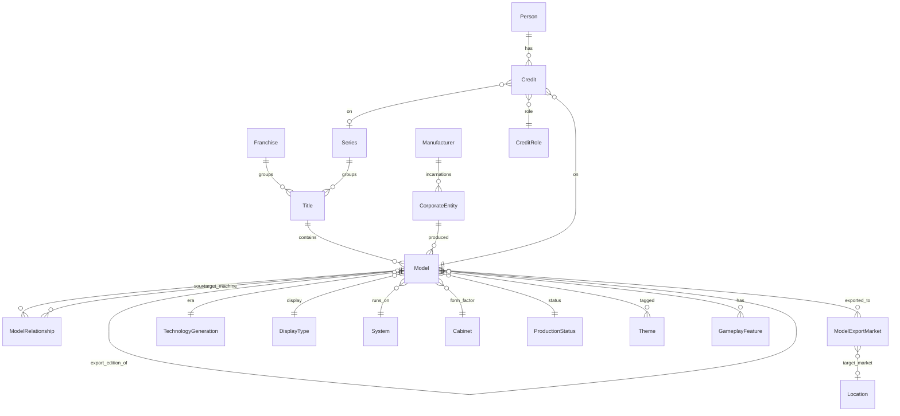

# Catalog Domain Model

This document describes the catalog domain model — the entities and relationships that represent the world of pinball machines.

> **Django naming note:** The domain concept "Model" maps to the Django class `MachineModel` to avoid collision with Django's own `Model` base class. This document uses the domain name "Model" throughout.

## Title, Model & Variants

The _Godzilla_ `Title` has four `Model`s:

| Title    | Model                       | Year | variant_of         |
| -------- | --------------------------- | ---- | ------------------ |
| Godzilla | Godzilla (Pro)              | 2021 | —                  |
| Godzilla | Godzilla (Premium)          | 2021 | —                  |
| Godzilla | Godzilla (Limited Edition)  | 2021 | Godzilla (Premium) |
| Godzilla | Godzilla (70th Anniversary) | 2024 | Godzilla (Premium) |

- **`Title`**: the canonical identity of a game design, regardless of editions or manufacturers. _Medieval Madness_ is one Title spanning the 1997 Williams original and all Chicago Gaming remakes.
- **`Model`**: a distinct, buyable machine — an actual SKU. The _Medieval Madness_ Title contains six Models: the Williams original (1997), and five Chicago Gaming remakes (2015–2025).
- **`Variants`**: a Model that shares the same gameplay as another Model, differing only in cosmetics (cabinet art, numbered plaques, toppers, colored plastics). Variants are linked via `variant_of`. Godzilla Pro and Premium are separate canonical Models because they have different gameplay and hardware. The LE and 70th Anniversary models are variants of Premium: same gameplay, different dress.

A standalone game that has never been remade — like Gottlieb's 1965 _Buckaroo_ — has one `Title` and one `Model`. See [SingleModelTitles.md](SingleModelTitles.md) for how this case is handled in the UI.

### Model dates

A Model carries two optional dates, each a year plus optional month: the **production date** (`production_year`/`production_month`) — physical assembly and factory rollout — and the earlier **project date** (`project_year`/`project_month`) — when the design was finalized, logged in internal corporate documentation, or approved/released to production by the manufacturer (sometimes called the Release-to-Production Date or Design Date in company archives). A project date is never later than the production date. Wherever the catalog shows, sorts, filters or aggregates a single model date (the derived `year`/`month`), it uses the production date and falls back to the project date; neither date is displayed as a standalone field on the detail page.

### Remakes

The _Cactus Canyon_ Title includes the 1998 original and its remakes by Chicago Gaming:

| Title         | Model                     | Manufacturer   | Year | remake_of     |
| ------------- | ------------------------- | -------------- | ---- | ------------- |
| Cactus Canyon | Cactus Canyon             | Midway / WMS   | 1998 | —             |
| Cactus Canyon | Cactus Canyon (Remake LE) | Chicago Gaming | 2021 | Cactus Canyon |
| Cactus Canyon | Cactus Canyon (Remake SE) | Chicago Gaming | 2021 | Cactus Canyon |

A **remake** is a Model that recreates an older game with new technology. Linked via `remake_of`. The original and its remakes all belong to the same Title.

### Model relationships

Copies, conversions, conversion kits and re-themes use `ModelRelationship`, a typed edge from one Model to a target. A model can have several edges of the same type, so a copy can draw from several designs, a conversion kit can fit several donor machines and a re-theme can name more than one donor.

Each edge carries:

- exactly one target: `target_machine` for a seeded Model, or `target_label` for a plain-text target such as "many late 1970s solid state Gottliebs" (some types require a seeded `target_machine` — see [Re-themes](#re-themes))
- a `relationship_type`: `copy`, `conversion`, `conversion_kit` or `retheme`
- a `license_status`: `licensed`, `unlicensed` or `unknown`

A model can have many machine-target edges but at most one text-target edge. Text targets are useful when the source names a plural or unidentified target rather than one resolvable Model.

#### Conversions and conversion kits

A **conversion** is a complete machine built by reusing another machine or its components with a new playfield, rules or theme. A **conversion kit** is a set of parts sold to convert a compatible donor machine; its target means "works with this donor", not "this individual machine was built from this donor".

| Model        | Manufacturer         | Relationship type | Target                                | License status |
| ------------ | -------------------- | ----------------- | ------------------------------------- | -------------- |
| Challenger V | Professional Pinball | conversion        | Star Trek (Bally, 1979)               | unknown        |
| Dark Rider   | Geiger-Automatenbau  | conversion        | Star Trek (Bally, 1979)               | unknown        |
| Sky Warrior  | IDI                  | conversion_kit    | many late 1970s solid state Gottliebs | unknown        |

#### Copies

A **copy** reproduces another machine's design using newly built hardware. Authorization is independent of that physical relationship: an unlicensed copy is commonly called a **bootleg**, while a licensed copy is commonly called a **licensed build**. Those concepts are derived from `relationship_type` plus `license_status`; they are not fields or tags of their own.

| Model                      | Manufacturer  | Target                      | License status |
| -------------------------- | ------------- | --------------------------- | -------------- |
| Punky Willy                | Joctronic     | Rock                        | unknown        |
| Punky Willy                | Joctronic     | Rock Encore                 | unknown        |
| Party Animal (Bally Wulff) | Bally Wulff   | Party Animal (Bally Midway) | licensed       |
| Al Capone                  | LTD do Brasil | Speakeasy                   | unlicensed     |

The edge records what was copied; the copy's Title placement is a separate editorial decision. A renamed copy may have its own Title, while a same-name licensed build may share the original's Title. Copies remain ordinary commercially produced Models when that is their production history; license status does not replace `production_status`.

#### Re-themes

A **re-theme** keeps another machine's gameplay and re-skins it with new art and theme. Unlike the other edge types, a re-theme's donor is always a known, seeded machine, so a re-theme edge always carries `target_machine` and never `target_label` (a text-target re-theme is rejected). A single re-theme can name more than one donor — two edges — when its origin is genuinely ambiguous.

For re-themes the `license_status` reads as **official** (`licensed`) versus **unofficial** (`unlicensed`), and renders that way in the UI ("Official re-theme of…" / "Unofficial re-theme of…"). A same-manufacturer re-theme is official; a re-theme by another party is often unofficial, but with no licensing evidence either way it stays `unknown` rather than being assumed.

| Model                  | Manufacturer | Target                           | License status |
| ---------------------- | ------------ | -------------------------------- | -------------- |
| Metallica (Retheme)    | —            | Earthshaker (Williams, 1989)     | unlicensed     |
| Shrek                  | Stern        | Family Guy (Stern, 2007)         | licensed       |
| Actros Magic Tour 2013 | —            | Volcano (Gottlieb, 1981)         | unknown        |
| Actros Magic Tour 2013 | —            | Mars God of War (Gottlieb, 1981) | unknown        |

### Export editions

Some models were built specifically to serve a foreign market — usually an add-a-ball or novelty edition of a replay/payout game, made for a jurisdiction that didn't allow the original's reward type. Two structures carry this:

- **`export_edition_of`**: a scalar lineage FK like `variant_of` and `remake_of` — a model is the export edition of at most one domestic original. It is deliberately **not** a `ModelRelationship` edge type: the relationship is 1:1, and licensing doesn't apply (an unauthorized "export" is a copy, not an export). A model can carry `export_edition_of` **and** other relationships (`variant_of`, a `copy` edge), usually to the same target. When the domestic original is unknown, the FK stays null and the export fact lives in `ModelExportMarket` alone.
- **`ModelExportMarket`**: a join table recording each destination market. A row's target is a country (`target_market_location`, restricted to top-level Locations), a free-text region label (`target_market_label`, e.g. "Europe"), or neither — the row itself then records "built for export" with an unknown destination. A model has either multiple country rows, a single label row, or a single unknown row; a null-location row must be the model's only row.

| Model           | Manufacturer | export_edition_of | Export markets |
| --------------- | ------------ | ----------------- | -------------- |
| Big Ben (Italy) | Williams     | Big Ben           | Italy          |
| Dragon          | Interflip    | Dragoon           | —              |
| Phantom Haus    | Williams     | Fun House         | Europe         |

A model is an export model when `export_edition_of` is set **or** an export-market row exists. Like copies and re-themes, an export edition never outranks its domestic original when they share a Title (the Big Ben rule).

## Franchises & Series

| Franchise | Series       | Title                          | Manufacturer | Year |
| --------- | ------------ | ------------------------------ | ------------ | ---- |
| Star Trek | —            | Star Trek                      | Bally        | 1979 |
| Star Trek | —            | Star Trek                      | Data East    | 1991 |
| Star Trek | —            | Star Trek: The Next Generation | Williams     | 1993 |
| Star Trek | —            | Star Trek                      | Stern        | 2013 |
| —         | Black Knight | Black Knight                   | Williams     | 1980 |
| —         | Black Knight | Black Knight 2000              | Williams     | 1989 |
| —         | Black Knight | Black Knight: Sword of Rage    | Stern        | 2019 |

- **Franchise**: groups Titles related by intellectual property, regardless of manufacturer. The _Star Trek_ Franchise spans Titles produced by Bally, Data East, Williams, and Stern across different eras.
- **Series**: groups Titles that share a design lineage by the same creative team. The _Black Knight_ Series spans Williams and Stern. Steve Ritchie is credited with Design on the Series.
- A Title belongs to at most one Series; a Series can group many Titles.
- People can be credited on a Series via the Credit entity.

Most Titles do not belong to any Franchise or Series.

## Manufacturer & Corporate Structure

The WMS cluster illustrates how Manufacturers and CorporateEntities relate:

| Manufacturer | CorporateEntity                                                        |
| ------------ | ---------------------------------------------------------------------- |
| Williams     | Williams Manufacturing Company                                         |
| Williams     | Williams Electronic Manufacturing Corporation                          |
| Williams     | Williams Electronics, Incorporated                                     |
| Williams     | Williams Electronics Games, Inc., a subsidiary of WMS Industries, Inc. |
| Bally        | Bally Manufacturing Corporation                                        |
| Bally        | Bally Midway Manufacturing Company                                     |
| Bally        | Midway Manufacturing Company, a subsidiary of WMS Industries, Inc.     |

- **Manufacturer**: a pinball manufacturer as users know it — the brand name shown on the cabinet.
- **CorporateEntity**: a specific corporate incarnation of a Manufacturer. Companies reorganize, get acquired, and change names over the decades. Models link to CorporateEntity (not Manufacturer) to record exactly which corporate incarnation produced them.

### CorporateEntityLocation

Links a CorporateEntity to a Location (e.g., Stern Pinball, Incorporated → Chicago, Illinois).

## People & Credits

### Person

A person involved in pinball design — designers, artists, programmers, etc. May include biographical fields like birth/death dates and nationality.

### Credit

Links a Person to a Model or Series with a specific CreditRole. For example, _Medieval Madness_ credits include:

- Brian Eddy — Design
- Greg Freres — Art
- John Youssi — Art
- Adam Rhine — Dots/Animation

### CreditRole

A taxonomy of credit types: Design, Concept, Art, Dots/Animation, Mechanics, Music, Sound, Voice, Software, Other.

## Hardware & Systems

### System

The electronic hardware platform a machine runs on — e.g., Williams WPC-95, Bally AS-2518-35, Stern SPIKE, CGC Pinball Controller/OS. Systems belong to a Manufacturer and are classified by TechnologySubgeneration.

The original _Medieval Madness_ (1997) runs on Williams WPC-95. The Chicago Gaming remakes run on CGC Pinball Controller/OS.

## Taxonomy & Classification

### Technology Generation

**TechnologyGeneration** — the major technological era:

- `pure-mechanical`: gravity, springs and pins; no electricity.
- `electromechanical`: relays, solenoids and stepping motors; the flipper era.
- `solid-state`: microprocessor-controlled, from 1977 onward.

**TechnologySubgeneration** — subdivision within a generation. `solid-state` breaks down into:

- `ss-discrete`: custom CPU boards built from off-the-shelf microprocessors (1977–1990).
- `ss-integrated`: purpose-built unified pinball platforms like Williams WPC (1986 onward).
- `ss-pc`: commodity PC/ARM hardware running general-purpose operating systems (2013 onward).

### Display Type

**DisplayType** — the display technology:

- `score-reels`: mechanical rotating drums, one digit each.
- `backglass-lights`: fixed-value bulbs lit behind the backglass.
- `alphanumeric`: segmented LED panels showing numbers and text.
- `cga`: color CRT monitor for integrated video sequences.
- `dot-matrix`: a 128×32 addressable dot grid (DMD).
- `lcd`: a full-resolution HD video screen.

**DisplaySubtype** — subdivision within a type.

`alphanumeric`:

- `nixie-tube`: cold-cathode gas-discharge numerals.
- `7-segment`: seven-bar LED digits; numbers and a few letters.
- `16-segment`: sixteen-bar LED digits; the full alphabet.

`dot-matrix`:

- `plasma-dmd`: the original orange gas-discharge panel.
- `color-led-dmd`: an RGB LED replacement at the same resolution.

### Production Status

Whether or not a Model reached commercial production. Values:

- `announced`: officially announced but not yet shipped
- `produced`: commercially produced and sold, even if only in small quantities
- `unreleased`: a project intended for commercial production, but cancelled. It may have resulted in prototypes or sample runs.
- `one-off`: one-of-a-kind or few-of-a-kind, built by a manufacturer but never intended for commercial production — e.g. gifts, movie props and test pieces.
- `aftermarket`: a machine modified by someone other than the original manufacturer (fan re-themes, operators, modders); not an official commercial release. A fan re-theme's donor is recorded structurally as a `retheme` [model relationship](#re-themes).

### Tag

Classification labels that don't fit elsewhere. As related clusters of tags emerge, we may shift the cluster to more structured data, such as creating an entity for an exclusive set of tags:

- `flipperless`: has no player-controlled flippers; the ball is put into play with a plunger and scored by where it settles.
- `home-use`: designed or marketed for home use rather than commercial coin-op routes.
- `limited-edition`: produced in a deliberately limited, usually numbered run — a manufacturer's LE or collector's trim of a title.
- `prototype`: an engineering sample, design proof or pre-production test unit.
- `widebody`: a wider-than-standard cabinet and playfield.
- `wwii-contract`: built by an amusement-machine manufacturer under a World War II government contract, rather than for the coin-op trade.

Remakes are not a tag: the `remake_of` [model relationship](#remakes) records that lineage structurally.

### Cabinet

Form factor of the physical cabinet:

- `floor`: the standard full-sized, free-standing unit with a vertical backbox — what people mean by "pinball machine" without qualification.
- `tabletop`: a miniaturized unit with reduced backbox and no legs, designed to sit on a table or counter.
- `countertop`: the smallest coin-op format, light enough for one person to move and designed to sit on a bar or counter.
- `cocktail`: a horizontal, table-height unit with a flat glass top; players look down onto the playfield while seated.

### GameFormat

The type of game:

- `pinball`: a steel ball launched onto a tilted playfield, scored by hitting targets and — on flipper-era machines — kept alive with player-controlled [flippers](#gameplayfeature).
- `bagatelle`: balls launched up an inclined surface that fall by gravity into scoring holes and pockets; the direct ancestor of pinball.
- `shuffle`: a puck or ball slid down a long polished surface toward scoring zones.
- `rolldown`: balls rolled by hand down a long cabinet into scoring holes or pockets rather than launched by a plunger; distinct from `shuffle`, where a puck is slid toward open scoring zones instead.
- `pitch-and-bat`: a coin-op baseball game with a mechanical pitch and a player-swung bat.
- `slot-machine`: a coin-op gambling machine paying out by chance rather than skill.
- `video-game`: played on a video screen rather than a physical playfield.
- `gun-game`: a shooting game aiming a mechanical gun or rifle at targets.
- `one-ball`: a coin-op gambling machine — one ball per coin, paying out in cash or tickets when it lands in a winning hole; often horse-race themed, and the payout format that preceded `bingo-pinball`.
- `bingo-pinball`: a coin-op gambling machine — five balls shot into a grid of holes to line up numbers on a 5×5 card printed on the backglass; classically flipperless, though later export machines added flippers.
- `miscellaneous`: a catch-all for machines that fit no more specific format.

### RewardType

Reward mechanisms:

- `replay`: a free game awarded for a high score, objective or end-of-game match.
- `add-a-ball`: an extra ball rather than a free game.
- `novelty`: no reward; the game is offered purely for amusement.
- `cash-payout`: coins dispensed directly based on scoring.
- `ticket-payout`: redeemable paper tickets dispensed based on score.
- `merchant-paid`: the machine displays the fact of winning, but the award is handed over at the location, in cash, trade credit or goods.
- `free-play`: no coin required to start — the absence of the coin-op transaction rather than a reward.

### Theme

Thematic tags organized in a DAG hierarchy (e.g., "Burlesque" under parent "Adult"). Models can have multiple themes.

### GameplayFeature

Gameplay mechanisms organized in a DAG hierarchy (e.g., "2-Ball Multiball" under parent "Multiball", "3-Bank Drop Targets" under "Bank Drop Targets"). The Model-to-GameplayFeature relationship carries an optional count (e.g., Flippers × 2).

## Location

**Location** represents geographic places. Used primarily to track where CorporateEntities were based.

Modeled as a nested hierarchy: `usa/il/chicago`.

## Fields Common to All Catalog Entities

- `name`: human-friendly name
- `public_id`: URL-friendly identifier. Usually maps to a `slug` field, but for Location maps to `location_path` (`usa/il/chicago`).
- `description`: markdown text
- `created_at` / `updated_at`: bookkeeping timestamps

### Aliases

Many entities support aliases — alternate names used for matching and search. Entities with aliases include: Manufacturer, CorporateEntity, Person, Theme, GameplayFeature, RewardType, Location, Title (abbreviations), and Model (abbreviations).

### Claims & Provenance

Nearly all fields on catalog entities are claims-controlled — their values are resolved from the provenance system rather than set directly. See [Provenance.md](Provenance.md) for architecture details.
