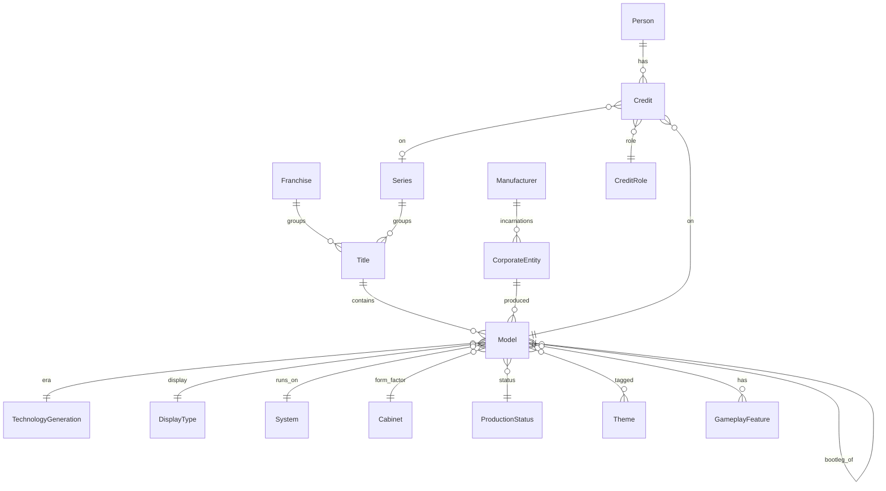

# Catalog Domain Model

This document describes the catalog domain model — the entities and relationships that represent the world of pinball machines.

> **Django naming note:** The domain concept "Model" maps to the Django class `MachineModel` to avoid collision with Django's own `Model` base class. This document uses the domain name "Model" throughout.

## Title, Model & Variants

The _Godzilla_ `Title` has four `Model`s:

| Title    | Model                       | Year | variant_of         |
| -------- | --------------------------- | ---- | ------------------ |
| Godzilla | Godzilla (Pro)              | 2021 | —                  |
| Godzilla | Godzilla (Premium)          | 2021 | —                  |
| Godzilla | Godzilla (Limited Edition)  | 2021 | Godzilla (Premium) |
| Godzilla | Godzilla (70th Anniversary) | 2024 | Godzilla (Premium) |

- **`Title`**: the canonical identity of a game design, regardless of editions or manufacturers. _Medieval Madness_ is one Title spanning the 1997 Williams original and all Chicago Gaming remakes.
- **`Model`**: a distinct, buyable machine — an actual SKU. The _Medieval Madness_ Title contains six Models: the Williams original (1997), and five Chicago Gaming remakes (2015–2025).
- **`Variants`**: a Model that shares the same gameplay as another Model, differing only in cosmetics (cabinet art, numbered plaques, toppers, colored plastics). Variants are linked via `variant_of`. Godzilla Pro and Premium are separate canonical Models because they have different gameplay and hardware. The LE and 70th Anniversary models are variants of Premium: same gameplay, different dress.

A standalone game that has never been remade — like Gottlieb's 1965 _Buckaroo_ — has one `Title` and one `Model`. See [SingleModelTitles.md](SingleModelTitles.md) for how this case is handled in the UI.

### Remakes

The _Cactus Canyon_ Title includes the 1998 original and its remakes by Chicago Gaming:

| Title         | Model                     | Manufacturer   | Year | remake_of     |
| ------------- | ------------------------- | -------------- | ---- | ------------- |
| Cactus Canyon | Cactus Canyon             | Midway / WMS   | 1998 | —             |
| Cactus Canyon | Cactus Canyon (Remake LE) | Chicago Gaming | 2021 | Cactus Canyon |
| Cactus Canyon | Cactus Canyon (Remake SE) | Chicago Gaming | 2021 | Cactus Canyon |

A **remake** is a Model that recreates an older game with new technology. Linked via `remake_of`. The original and its remakes all belong to the same Title.

### Conversions

_Star Trek_ (Bally, 1979) was converted into machines by other manufacturers:

| Title     | Model        | Manufacturer         | Year | converted_from |
| --------- | ------------ | -------------------- | ---- | -------------- |
| Star Trek | Star Trek    | Bally                | 1979 | —              |
| Star Trek | Challenger V | Professional Pinball | 1981 | Star Trek      |
| Star Trek | Dark Rider   | Geiger-Automatenbau  | 1985 | Star Trek      |

A **conversion** is a Model that reuses the physical cabinet of another machine with a new playfield or theme. Linked via `converted_from`.

### Bootlegs

A **bootleg** is a complete machine, built from scratch, that is an unauthorized copy of another maker's game — common among mid-century Italian and Spanish makers. It is linked to the game it copies via `bootleg_of`, carries the `bootleg` tag and keeps a normal `produced` production status (it is a real commercial machine, just unauthorized). The pinball community uses "bootleg" for both faithful reproductions and renamed/reskinned copies, so there is one relation, not a per-degree taxonomy.

| Title         | Model         | Manufacturer  | bootleg_of                  |
| ------------- | ------------- | ------------- | --------------------------- |
| Alien Poker   | Alien Poker   | Williams      | —                           |
| Alien Poker   | Space Poker   | LTD do Brasil | Alien Poker                 |
| Video Pinball | Video Pinball | Atari         | —                           |
| Rugby         | Rugby         | Sidam         | Video Pinball (other Title) |

Unlike `remake_of` and `converted_from`, which stay within one Title by convention, `bootleg_of` records only _what was copied_ — where the bootleg's Model is filed is an independent editorial decision. A renamed bootleg (Sidam's _Rugby_, a copy of Atari's _Video Pinball_) sits under its own Title, so `bootleg_of` is the one lineage relation that routinely points across Titles; a same-name copy (LTD's _Space Poker_) may share the original's Title.

## Franchises & Series

| Franchise | Series       | Title                          | Manufacturer | Year |
| --------- | ------------ | ------------------------------ | ------------ | ---- |
| Star Trek | —            | Star Trek                      | Bally        | 1979 |
| Star Trek | —            | Star Trek                      | Data East    | 1991 |
| Star Trek | —            | Star Trek: The Next Generation | Williams     | 1993 |
| Star Trek | —            | Star Trek                      | Stern        | 2013 |
| —         | Black Knight | Black Knight                   | Williams     | 1980 |
| —         | Black Knight | Black Knight 2000              | Williams     | 1989 |
| —         | Black Knight | Black Knight: Sword of Rage    | Stern        | 2019 |

- **Franchise**: groups Titles related by intellectual property, regardless of manufacturer. The _Star Trek_ Franchise spans Titles produced by Bally, Data East, Williams, and Stern across different eras.
- **Series**: groups Titles that share a design lineage by the same creative team. The _Black Knight_ Series spans Williams and Stern. Steve Ritchie is credited with Design on the Series.
- A Title belongs to at most one Series; a Series can group many Titles.
- People can be credited on a Series via the Credit entity.

Most Titles do not belong to any Franchise or Series.

## Manufacturer & Corporate Structure

The WMS cluster illustrates how Manufacturers and CorporateEntities relate:

| Manufacturer | CorporateEntity                                                        |
| ------------ | ---------------------------------------------------------------------- |
| Williams     | Williams Manufacturing Company                                         |
| Williams     | Williams Electronic Manufacturing Corporation                          |
| Williams     | Williams Electronics, Incorporated                                     |
| Williams     | Williams Electronics Games, Inc., a subsidiary of WMS Industries, Inc. |
| Bally        | Bally Manufacturing Corporation                                        |
| Bally        | Bally Midway Manufacturing Company                                     |
| Bally        | Midway Manufacturing Company, a subsidiary of WMS Industries, Inc.     |

- **Manufacturer**: a pinball brand as users know it — the name on the cabinet.
- **CorporateEntity**: a specific corporate incarnation of a Manufacturer. Companies reorganize, get acquired, and change names over the decades. Models link to CorporateEntity (not Manufacturer) to record exactly which corporate incarnation produced them.

### CorporateEntityLocation

Links a CorporateEntity to a Location (e.g., Stern Pinball, Incorporated → Chicago, Illinois).

## People & Credits

### Person

A person involved in pinball design — designers, artists, programmers, etc. May include biographical fields like birth/death dates and nationality.

### Credit

Links a Person to a Model or Series with a specific CreditRole. For example, _Medieval Madness_ credits include:

- Brian Eddy — Design
- Greg Freres — Art
- John Youssi — Art
- Adam Rhine — Dots/Animation

### CreditRole

A taxonomy of credit types: Design, Concept, Art, Dots/Animation, Mechanics, Music, Sound, Voice, Software, Other.

## Hardware & Systems

### System

The electronic hardware platform a machine runs on — e.g., Williams WPC-95, Bally AS-2518-35, Stern SPIKE, CGC Pinball Controller/OS. Systems belong to a Manufacturer and are classified by TechnologySubgeneration.

The original _Medieval Madness_ (1997) runs on Williams WPC-95. The Chicago Gaming remakes run on CGC Pinball Controller/OS.

## Taxonomy & Classification

### Technology Generation

**TechnologyGeneration** — the major technological era:

- `pure-mechanical`: gravity, springs and pins; no electricity.
- `electromechanical`: relays, solenoids and stepping motors; the flipper era.
- `solid-state`: microprocessor-controlled, from 1977 onward.

**TechnologySubgeneration** — subdivision within a generation. `solid-state` breaks down into:

- `ss-discrete`: custom CPU boards built from off-the-shelf microprocessors (1977–1990).
- `ss-integrated`: purpose-built unified pinball platforms like Williams WPC (1986 onward).
- `ss-pc`: commodity PC/ARM hardware running general-purpose operating systems (2013 onward).

### Display Type

**DisplayType** — the display technology:

- `score-reels`: mechanical rotating drums, one digit each.
- `backglass-lights`: fixed-value bulbs lit behind the backglass.
- `alphanumeric`: segmented LED panels showing numbers and text.
- `cga`: color CRT monitor for integrated video sequences.
- `dot-matrix`: a 128×32 addressable dot grid (DMD).
- `lcd`: a full-resolution HD video screen.

**DisplaySubtype** — subdivision within a type.

`alphanumeric`:

- `nixie-tube`: cold-cathode gas-discharge numerals.
- `7-segment`: seven-bar LED digits; numbers and a few letters.
- `16-segment`: sixteen-bar LED digits; the full alphabet.

`dot-matrix`:

- `plasma-dmd`: the original orange gas-discharge panel.
- `color-led-dmd`: an RGB LED replacement at the same resolution.

### Production Status

Whether or not a Model reached commercial production. Values:

- `announced`: officially announced but not yet shipped
- `produced`: commercially produced and sold, even if only in small quantities
- `unreleased`: a project intended for commercial production, but cancelled. It may have resulted in prototypes or sample runs.
- `one-off`: one-of-a-kind or few-of-a-kind, built by a manufacturer but never intended for commercial production — e.g. gifts, movie props and test pieces.
- `aftermarket`: a machine modified by someone other than the original manufacturer (fan re-themes, operators, modders); not an official commercial release. Usually paired with the `unofficial-retheme` tag.

### Tag

Classification labels that don't fit elsewhere. As related clusters of tags emerge, we may shift the cluster to more structured data, such as creating an entity for an exclusive set of tags:

- `home-use`: designed or marketed for home use rather than commercial coin-op routes.
- `prototype`: an engineering sample, design proof or pre-production test unit.
- `widebody`: a wider-than-standard cabinet and playfield.
- `remake`: a newly manufactured recreation of an earlier title (not a restored original). See [Remakes](#remakes); the `remake_of` link records the lineage.
- `conversion-kit`: sold as a kit of parts to install into an existing machine, not a complete machine. See [Conversions](#conversions); the `converted_from` link records the source machine.
- `export`: manufactured for markets outside the United States.
- `unofficial-retheme`: a re-skin by a non-manufacturer (fan/operator/modder). Paired with the `aftermarket` production status.
- `manufacturer-retheme`: an official re-theme a manufacturer applied to one of its own designs.
- `bootleg`: a complete machine, built from scratch, that is an unauthorized copy of another maker's game. See [Bootlegs](#bootlegs); the `bootleg_of` link records the copied machine.

### Cabinet

Form factor of the physical cabinet:

- `floor`: the standard full-sized, free-standing unit with a vertical backbox — what people mean by "pinball machine" without qualification.
- `tabletop`: a miniaturized unit with reduced backbox and no legs, designed to sit on a table or counter.
- `countertop`: the smallest coin-op format, light enough for one person to move and designed to sit on a bar or counter.
- `cocktail`: a horizontal, table-height unit with a flat glass top; players look down onto the playfield while seated.

### GameFormat

The type of game:

- `pinball`: a steel ball launched onto a tilted playfield, scored by hitting targets and — on flipper-era machines — kept alive with player-controlled [flippers](#gameplayfeature).
- `bagatelle`: balls launched up an inclined surface that fall by gravity into scoring holes and pockets; the direct ancestor of pinball.
- `shuffle`: a puck or ball slid down a long polished surface toward scoring zones.
- `pitch-and-bat`: a coin-op baseball game with a mechanical pitch and a player-swung bat.
- `slot-machine`: a coin-op gambling machine paying out by chance rather than skill.
- `video-game`: played on a video screen rather than a physical playfield.
- `gun-game`: a shooting game aiming a mechanical gun or rifle at targets.
- `miscellaneous`: a catch-all for machines that fit no more specific format.

### RewardType

Reward mechanisms:

- `replay`: a free game awarded for a high score, objective or end-of-game match.
- `add-a-ball`: an extra ball rather than a free game.
- `novelty`: no reward; the game is offered purely for amusement.
- `cash-payout`: coins dispensed directly based on scoring.
- `ticket-payout`: redeemable paper tickets dispensed based on score.
- `free-play`: no coin required to start — the absence of the coin-op transaction rather than a reward.

### Theme

Thematic tags organized in a DAG hierarchy (e.g., "Burlesque" under parent "Adult"). Models can have multiple themes.

### GameplayFeature

Gameplay mechanisms organized in a DAG hierarchy (e.g., "2-Ball Multiball" under parent "Multiball", "3-Bank Drop Targets" under "Bank Drop Targets"). The Model-to-GameplayFeature relationship carries an optional count (e.g., Flippers × 2).

## Location

**Location** represents geographic places. Used primarily to track where CorporateEntities were based.

Modeled as a nested hierarchy: `usa/il/chicago`.

## Fields Common to All Catalog Entities

- `name`: human-friendly name
- `public_id`: URL-friendly identifier. Usually maps to a `slug` field, but for Location maps to `location_path` (`usa/il/chicago`).
- `description`: markdown text
- `created_at` / `updated_at`: bookkeeping timestamps

### Aliases

Many entities support aliases — alternate names used for matching and search. Entities with aliases include: Manufacturer, CorporateEntity, Person, Theme, GameplayFeature, RewardType, Location, Title (abbreviations), and Model (abbreviations).

### Claims & Provenance

Nearly all fields on catalog entities are claims-controlled — their values are resolved from the provenance system rather than set directly. See [Provenance.md](Provenance.md) for architecture details.
